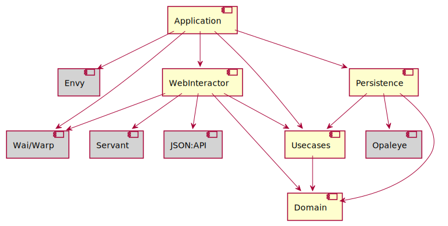

# Ingestair - Alternate Clair Data Ingestion Application

Ingestair is part of the _Clair Platform_, a system to collect measurements from networked CO2-sensors for indoor air-quality monitoring. It is developed and run by the [Clair Berlin Initiative](https://clair-berlin.de), a non-profit, open-source initiative to help operators of public spaces lower the risk of SARS-CoV2-transmission amongst their patrons.

Technically speaking, Ingestair is a service in the [Clair Stack](https://github.com/ClairBerlin/clair-stack), which is the infrastructure-as-code implementation of the Clair Platf

This is an alternate implementation of the sample data ingestion engine.
In the regular clair-stack, the ingestair is a Django ReST application whose sole purpose is to receive samples as POST request and to persist them in the database shared with the _managair_ application.

## Build

The ingestair application is build using the the [Haskell Tool Stack](https://docs.haskellstack.org/en/stable/README/). Use the default [workflow](https://docs.haskellstack.org/en/stable/README/#workflow) to build it.

## Run

Ingestair reads its configuration from the following environment variables:

- `SERVER_PORT`: The port on which the web server listens.
- `LOG_LEVEL`: Can be `DEBUG`, `INFO`, `WARN`, or `ERROR` (default: `WARN`)
- `LOG_VERBOSE`: Generate additional log output? (True/False, default: False)
- `LOG_USE_TIME`: Log time stamps with each message? (True/False, default: True)
- `LOG_USE_LOC`: Log source code location with each message? (True/False, default: False)
- `LOG_USE_COLOR`: Write teminal log in color? (True/False, default: True)
- `SQL_HOST`: Host name of the DBMS (default: `localhost`).
- `SQL_PORT`: DBMS port (default: 5432).
- `SQL_DATABASE`: Database name (default: `managairdb_dev`).
- `SQL_USER`: Database user (default: `managair_dev`).
- `SQL_PASSWORD`: Database master password (default: `postgres`).

## Design and Architecture

This alternate implementation is written in the purely functional programming language [Haskell](https://www.haskell.org/), just for the fun of it.
My goal with this implementation is to understand how to best structure a real-world production-ready web application in Haskell, which libraries to use, how to do error handling, logging, and similar production issues.

In particular, the application uses:

- The [RIO](https://hackage.haskell.org/package/rio) standard library, instead of Haskell's standard prelude.
- The [ReaderT design pattern](https://www.fpcomplete.com/blog/2017/06/readert-design-pattern/) as a general way to thread configuration information through the application. The application uses the [RIO monad](https://www.fpcomplete.com/haskell/library/rio/) (ReaderT over IO) to implement the pattern.
- The [Has* type class pattern](https://hackernoon.com/the-has-type-class-pattern-ca12adab70ae) to access elements of the global configuration and to indicate capabilities in types (instead of a full-blown effects system or a deep MTL-style transformer stack).
- [Servant](https://docs.servant.dev/en/stable/index.html) to model the web API and to generate a web-application-interface ([WAI](https://www.yesodweb.com/book/web-application-interface)) web application.
- [WARP](https://hackage.haskell.org/package/warp), the de-facto standard Haskell webserver.
- The [json-api-lib](https://hackage.haskell.org/package/json-api-lib) utilities to create [JSON:API](https://jsonapi.org/) resources.
- [Envy](https://hackage.haskell.org/package/envy) for reading configuration information from environment variables, following factor [III](https://12factor.net/config) from the [12-Factor-App](https://12factor.net/).
- [Opaleye](https://hackage.haskell.org/package/opaleye) as a type-safe way to access a PostgreSQL database.
- DBMS resource pooling using [resource-pool](https://hackage.haskell.org/package/resource-pool).

In adition, I wanted to understand how to best architecture and structure such an application.
Even though the functionality is minimal, I tried to come up with a "grown up" application architecture that follows Robert C. Martin's [Clean Architecture](https://blog.cleancoder.com/uncle-bob/2012/08/13/the-clean-architecture.html) principles, in particular, the _dependency rule_/
For an application like ingestair, with minimal functionality, the Clean Architecture approach is totally overengineered. But then, the application is simple enough to understant the key architectural issues.

Clean Architecture separates technical details of an application (like persistence or a web interface) from the core domain model and business logic.
The latter should be at the center of the application, and dependencies should point inwards only, towards the domain functionality.
In this way, changes to technical aspects to not result in changes to the application's core, and concerns remain separated.

Martin gives a canonical architectural decomposition, which I tried to follow closely in the ingestair application.

A dependency is any reference at the source code level: Whenever module A needs to import module B, this is a dependency.

Because technical aspects are most often accessed as libraries or frameworks, they must be isolated from the core.
