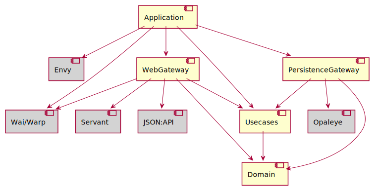

# Ingestair - Alternate Clair Data Ingestion Application

Ingestair is part of the _Clair Platform_, a system to collect measurements from networked CO2-sensors for indoor air-quality monitoring. It is developed and run by the [Clair Berlin Initiative](https://clair-berlin.de), a non-profit, open-source initiative to help operators of public spaces lower the risk of SARS-CoV2-transmission amongst their patrons.

Technically speaking, Ingestair is a service in the [Clair Stack](https://github.com/ClairBerlin/clair-stack), which is the infrastructure-as-code implementation of the Clair Platf

This is an alternate implementation of the sample data ingestion engine.
In the regular clair-stack, the ingestair is a Django ReST application whose sole purpose is to receive samples as POST request and to persist them in the database shared with the _managair_ application.

## Build

The ingestair application is build using the the [Haskell Tool Stack](https://docs.haskellstack.org/en/stable/README/). Use the default [workflow](https://docs.haskellstack.org/en/stable/README/#workflow) to build it.

## Run

Ingestair reads its configuration from the following environment variables:

- `SERVER_PORT`: The port on which the web server listens.
- `LOG_LEVEL`: Can be `DEBUG`, `INFO`, `WARN`, or `ERROR` (default: `WARN`)
- `LOG_VERBOSE`: Generate additional log output? (True/False, default: False)
- `LOG_USE_TIME`: Log time stamps with each message? (True/False, default: True)
- `LOG_USE_LOC`: Log source code location with each message? (True/False, default: False)
- `LOG_USE_COLOR`: Write teminal log in color? (True/False, default: True)
- `SQL_HOST`: Host name of the DBMS (default: `localhost`).
- `SQL_PORT`: DBMS port (default: 5432).
- `SQL_DATABASE`: Database name (default: `managairdb_dev`).
- `SQL_USER`: Database user (default: `managair_dev`).
- `SQL_PASSWORD`: Database master password (default: `postgres`).

## Design and Architecture

This alternate implementation is written in the purely functional programming language [Haskell](https://www.haskell.org/), just for the fun of it.
My goal with this implementation is to understand how to best structure a real-world production-ready web application in Haskell, which libraries to use, how to do error handling, logging, and similar production issues.

In particular, the application uses:

- The [RIO](https://hackage.haskell.org/package/rio) standard library, instead of Haskell's standard prelude.
- The [ReaderT design pattern](https://www.fpcomplete.com/blog/2017/06/readert-design-pattern/) as a general way to thread configuration information through the application. The application uses the [RIO monad](https://www.fpcomplete.com/haskell/library/rio/) (ReaderT over IO) to implement the pattern.
- The [Has* type class pattern](https://hackernoon.com/the-has-type-class-pattern-ca12adab70ae) to access elements of the global configuration and to indicate capabilities in types (instead of a full-blown effects system or a deep MTL-style transformer stack).
- [Servant](https://docs.servant.dev/en/stable/index.html) to model the web API and to generate a web-application-interface ([WAI](https://www.yesodweb.com/book/web-application-interface)) web application.
- [WARP](https://hackage.haskell.org/package/warp), the de-facto standard Haskell webserver.
- The [json-api-lib](https://hackage.haskell.org/package/json-api-lib) utilities to create [JSON:API](https://jsonapi.org/) resources.
- [Envy](https://hackage.haskell.org/package/envy) for reading configuration information from environment variables, following factor [III](https://12factor.net/config) from the [12-Factor-App](https://12factor.net/).
- [Opaleye](https://hackage.haskell.org/package/opaleye) as a type-safe way to access a PostgreSQL database.
- DBMS resource pooling using [resource-pool](https://hackage.haskell.org/package/resource-pool).

In adition, I wanted to understand how to best architecture and structure such an application.
Even though the functionality is minimal, I tried to come up with a "grown up" application architecture that follows Robert C. Martin's [Clean Architecture](https://blog.cleancoder.com/uncle-bob/2012/08/13/the-clean-architecture.html) principles, in particular, the _dependency rule_/
For an application like ingestair, with minimal functionality, the Clean Architecture approach is totally overengineered. But then, the application is simple enough to understant the key architectural issues.

Clean Architecture separates technical details of an application (like persistence or a web interface) from the core domain model and business logic.
The latter should be at the center of the application, and dependencies should point inwards only, towards the domain functionality.
In this way, changes to technical aspects to not result in changes to the application's core, and concerns remain separated.

Martin gives a canonical architectural decomposition, which I tried to follow closely in the ingestair application.
A dependency is any reference at the source code level: Whenever module A needs to import module B, this is a dependency.

- The _domain_ contains the domain model associated logic. Here, this is simply the model of a single _sample_, plus its validation rules.
Leveraging Haskell's strong type systems, the `Sample` type comes with a smart constructor that ensures that all `Sample` values are legal - according to the [parse, don't validate](https://lexi-lambda.github.io/blog/2019/11/05/parse-don-t-validate/) pattern.
`Sample` values can be used freely in the entire application without the need for additional validation. All domain code resides in the `domain` package, which does not depend on packages at higher layers.
- The `usescases` package would implement the core business logic - if there was any. 
This is where the Clean Architecture approach obviously is oberengineered for the application at hand, where the only use cases are to store and retrieve data.
Consequenyly, there is not much going on in the `usecases` package.
The key point, though, is that use cases handle domain values only.
Beause domain values are strongly typed, use case logic does not need to be concerned with validation.
All guarantees are embodied in the types.
Taken together, the `domain` and `usecases` packages implement the [Domain Model Pattern](https://martinfowler.com/eaaCatalog/domainModel.html): The domain types and functionality can be tailored to match the problem domain, without the need to cater for technical considerations that arise from persistence or the UI.
The price to pay are a range of [Data Mappers](https://martinfowler.com/eaaCatalog/dataMapper.html) at the boundaries to the web and for persistence.
- Hallmark of the Clean Architecture approach is to push the dependencies on libraries and frameworks to the outer layers, and to provide a clear boundary.
The `web` package contains the web interface of the application.
It uses [Servant](https://docs.servant.dev/en/stable/index.html) to define the API and set up a web server.
The resources of the API are defined here as well.
For the simple create/retrieve application at hand, there would be no need to differentiate between the domain types and the resource types.
Yet, to understand the implications, there nevertheless is `SampleResource` distinct from the domain `Sample` type.
The `SampleResource`, in turn, could be served in different representations.
Ingestair offers a single representation only, as [JSON:API](https://jsonapi.org/) document.
The web gateway is responsible converting to and from the domain `Sample` type and to handle all errors that might aries.
- Similar to the web gateway, persistence is a technical detail that the application core should not depend on.
And analogously to the resources of the web API, the persistence layer uses its own decoupled data model that matches the SQL relational variables in the underlying database.
The `usecases` package must be able to call the`persistence` package to store and load data;
yet, according to the _dependency rule_, the `usecases` package must not depend on the `persistence` package.
To this end, the `usecases` package defines the sample repository interface as a type class, which the `SampleRepository` module in the `persistence` package implements; this is _dependency inversion_.
- Finally, the application handles initial configuration from environment variables, sets up the logging subsystem, and then launches the webserver to listen for incoming requests.
The `env` record that the `main` function initializes contains all global configuration information. This record value is threaded throghout the entire application as _Reader_ environment in the `RIO env` monad.
Wiring up the inverted dependency between between `usescases` package and `persistence` package happens as in the `Configuration` module at top-level, where the `Env` configuration record is declared an instance of the interface type class.

The Clean Architecture approach is visible in the dependency graph above: Libraries are imported in the upper layer only; the `usecases` and `domain` modules do not depend on technical details.
The domain model and business logic can evolve independently.
The price to pay is significant boilerplate for mappers between web, persistence and domain types.
This overhead would not be necessary for a simple create/retrieve application as ingestair; yet, it provides for better isolation of concerns when the business logic becomes more involved.